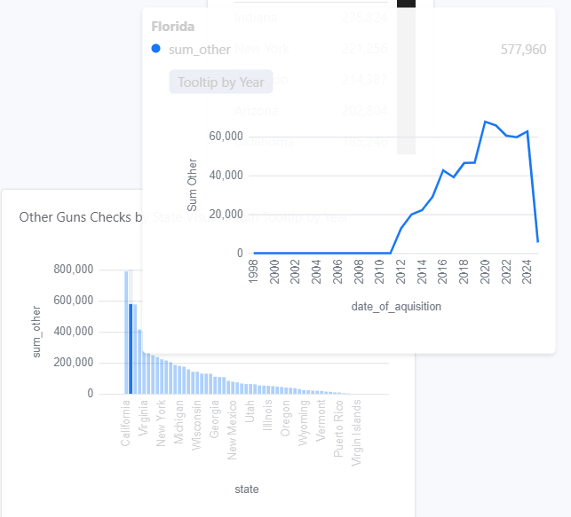
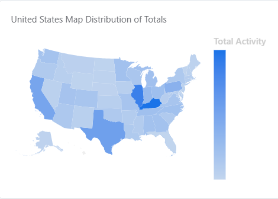
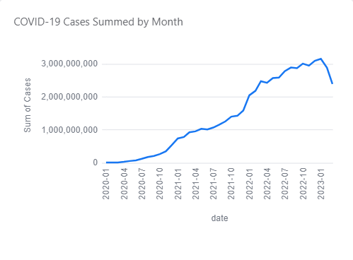
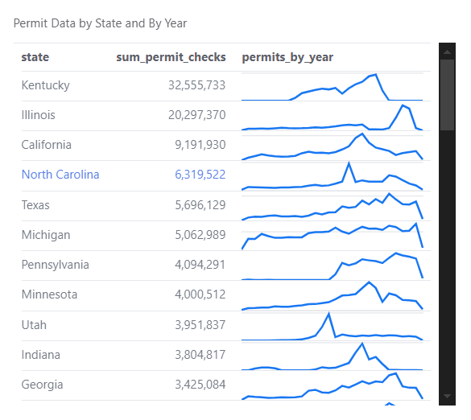
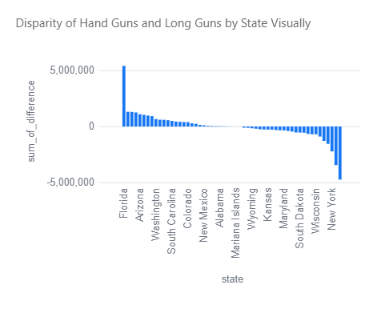

# 🔫 FBI NICS Firearm Background Check Data 📊

The data in this repository comes from the [FBI's National Instant Criminal Background Check System (NICS)](https://www.fbi.gov/about-us/cjis/nics). 🔍

---

### 📜 Background

> 🏛️ **Mandated by the Brady Handgun Violence Prevention Act of 1993**, the NICS was launched by the FBI on **November 30, 1998**. It helps **Federal Firearms Licensees (FFLs)** instantly determine whether a prospective buyer is eligible to purchase firearms or explosives. 🛒🔍 Before completing a sale, cashiers must check with the FBI or designated agencies to ensure the customer **does not have a criminal record or other disqualifying factors**. 🚫⚖️

📌 **Fast Facts:**
✅ Over **100 million** background checks conducted in the last decade  
🚫 More than **700,000** denials issued  

---

### 📊 About the Data

The FBI provides firearm check data by **month, state, and type**—but unfortunately, it's only available as a **PDF**. 😖📄 The code in this repository **downloads, parses, and converts** that PDF into a more usable **spreadsheet/CSV format**. 💾📈

🔗 **[Click here to download the data](data/nics-firearm-background-checks.csv?raw=true)** *(November 1998 – January 2025)*

---

### 📌 Important Notes & Caveats ⚠️

The original FBI report includes **important disclaimers** you should review. One of the most crucial is:

> ❗ These statistics represent the number of **firearm background checks initiated** through the NICS. They **do not** represent the **number of firearms sold**. A one-to-one correlation **cannot** be made between a background check and a firearm sale. 🔄🔫

### 📰 Additional Context

📢 A 2015 article from *The Trace* highlighted that **not all background checks are tied to gun sales**:

> 🔄 Many checks are for **concealed carry permits**, not actual firearm purchases.  
> 🔁 Kentucky, for example, **reruns checks monthly** for all concealed carry license holders.  
> 📋 **Private gun sales** often **do not require background checks**, affecting total numbers.  

📑 A **2017 study** published in the *Annals of Internal Medicine* surveyed 1,613 gun owners and found that **22%** of recent firearm acquisitions were made **without a background check**. 📊

---

### 🔎 Methodology & Sales Estimation 🛠️

Not all categories of background checks provide a **clear picture** of gun sales. When *The New York Times* analyzed NICS data in **Dec. 2015**, they noted:

> 📌 **Sales estimates** are based on **handgun, long gun, and multiple-gun background checks**.  
> 🏛️ **Permit checks** and other categories are **excluded**.  
> ⚖️ Due to differing **state laws**, sales figures **cannot be directly compared** across states.  

📊 **NYT’s Calculation Method:**

- 🏹 Each **long gun & handgun check** = **1.1 sales**  
- 🔫 Each **multiple-gun check** = **2 sales**  
- 🚫 **Permit checks & other categories omitted**  

*(Methodology adapted from the **[Small Arms Survey](http://www.smallarmssurvey.org/fileadmin/docs/F-Working-papers/SAS-WP14-US-Firearms-Industry.pdf)** by Jurgen Brauer, Georgia Regents University.)*

---

### 📚 Additional Resources 🔗

📘 **[NICS Federal Firearms Licensee Manual](https://www.fbi.gov/file-repository/nics-firearms-licensee-manual-111811.pdf/view)** – Comprehensive guide to NICS background checks.  

🗺️ **[NICS Participation Map](https://www.fbi.gov/file-repository/nics-participation-map.pdf/view)** – Visual representation of each state's participation level with the NICS.  

# Some Example Visualizations From the Data

